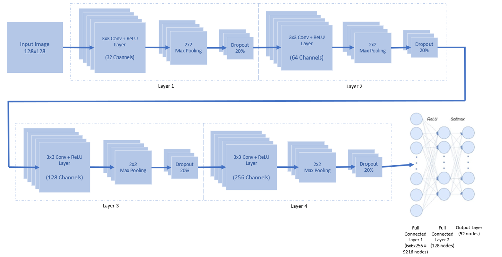

# Optical Character Recognition (OCR)

A CNN-based optical character recognition system that extracts text from images. Works with both typed and handwritten text in block letters.

[](Layers.png)

## 📋 Overview

This project utilizes a Convolutional Neural Network (CNN) to identify and extract text from images. The system:

- Processes images containing text
- Identifies individual characters using bounding boxes
- Converts the recognized characters to digital text format
- Supports both typed and handwritten text in block letters

## 🔍 Features

- Image preprocessing and text segmentation
- Character recognition using a trained CNN model
- Support for all alphanumeric characters (A-Z, a-z, 0-9)
- Multi-level contour detection (sentences → words → letters)
- Robust image processing with thresholding and dilation
- Data augmentation for improved model training

## 🧠 Model Architecture

The system employs a sophisticated multi-layer CNN with the following architecture:

- **Input Layer**: 128×128×1 grayscale images
- **Convolutional Layers**:
  - Conv2D (32 filters, 3×3 kernel) → ReLU → MaxPooling (2×2) → Dropout (0.2)
  - Conv2D (64 filters, 3×3 kernel) → ReLU → MaxPooling (2×2) → Dropout (0.2)
  - Conv2D (128 filters, 3×3 kernel) → ReLU → MaxPooling (2×2) → Dropout (0.2)
  - Conv2D (256 filters, 3×3 kernel) → ReLU → MaxPooling (2×2) → Dropout (0.2)
- **Fully Connected Layers**:
  - Flatten → Dense (128 neurons) → ReLU → Dropout (0.2)
  - Output Layer: Dense (52 neurons) → Softmax

The model is trained using the Adam optimizer with categorical cross-entropy loss function.

## 🛠️ Requirements

- Python 3.7+
- TensorFlow 2.2.1+
- OpenCV
- NumPy
- Matplotlib
- PIL (Python Imaging Library)
- Keras
- Pandas

## 📊 Dataset

- **Dataset Used**: Extended MNIST (EMNIST) for alphanumeric character classification
- **Files**: emnist-byclass-train.csv, emnist-byclass-test.csv
- **Character Set**: 62 classes (10 digits, 26 uppercase letters, 26 lowercase letters)
- **Source**: [EMNIST Dataset on Kaggle](https://www.kaggle.com/crawford/emnist)

## 🚀 Getting Started

### Setup Instructions

1. Clone this repository
2. Download the EMNIST dataset from Kaggle
3. Create the following directory structure:
   ```
   Project/
   ├── Dataset/
   │   ├── train_set/
   │   │   ├── U{A-Z}/
   │   │   ├── {a-z}/
   │   │   └── {0-9}/
   │   └── test_set/
   │       ├── U{A-Z}/
   │       ├── {a-z}/
   │       └── {0-9}/
   └── sentence/
       └── words/
           └── letter/
   ```
4. **Important**: Update file paths in all Python scripts to match your environment

### Running the Project

1. First convert CSV data to images:
   ```
   python csv_to_image\(emnist\).py
   ```
   This script:
   - Reads the EMNIST CSV file
   - Converts each row to a 28×28 pixel image
   - Organizes images into appropriate class folders
   - Corrects image orientation (flips and rotates as needed)

2. Train the CNN model on the EMNIST dataset:
   ```
   python letters\(emnist\).py
   ```
   This script:
   - Builds the CNN architecture
   - Uses data augmentation (rescaling, shearing, zooming) for training
   - Trains for 25 epochs with a batch size of 64
   - Saves the trained model as 'letter(only).h5'

3. Extract text from your images:
   ```
   python "bounding box.py"
   ```
   This script:
   - Loads the trained model
   - Processes input images to detect text regions
   - Applies hierarchical contour detection (sentences → words → letters)
   - Predicts characters using the trained model
   - Outputs the recognized text

## 🔄 Text Extraction Process

The text extraction follows a hierarchical approach:
1. **Preprocessing**: Grayscale conversion, thresholding, and dilation
2. **Line Detection**: Identifies text lines using contour detection
3. **Word Detection**: Segments each line into individual words
4. **Character Detection**: Isolates individual characters from each word
5. **Character Recognition**: Classifies each character using the trained CNN
6. **Text Assembly**: Reconstructs the detected characters into words and sentences

## 📝 Research Publication

This project has been published in a research paper:
- [IRJET Publication](https://www.irjet.net/archives/V7/i5/IRJET-V7I5964.pdf)

## 📄 License

This project is licensed under the terms of the included LICENSE file.

## 🖥️ Development Environment

- **Processor**: Intel i7 9th gen
- **GPU**: Nvidia RTX 2060 Mobile
- **RAM**: 16GB
- **Software**: Python 3.7, TensorFlow 2.2.1
